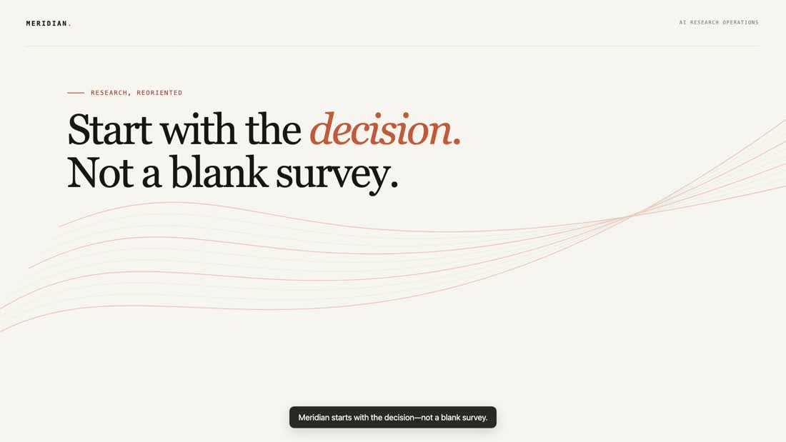
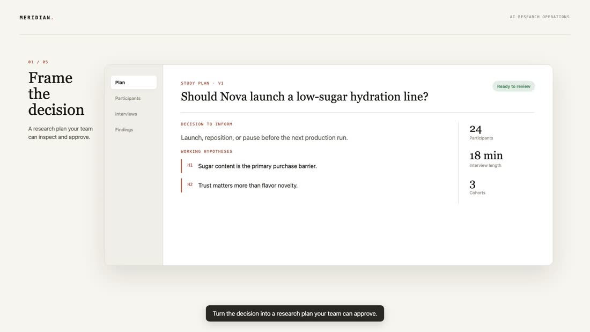
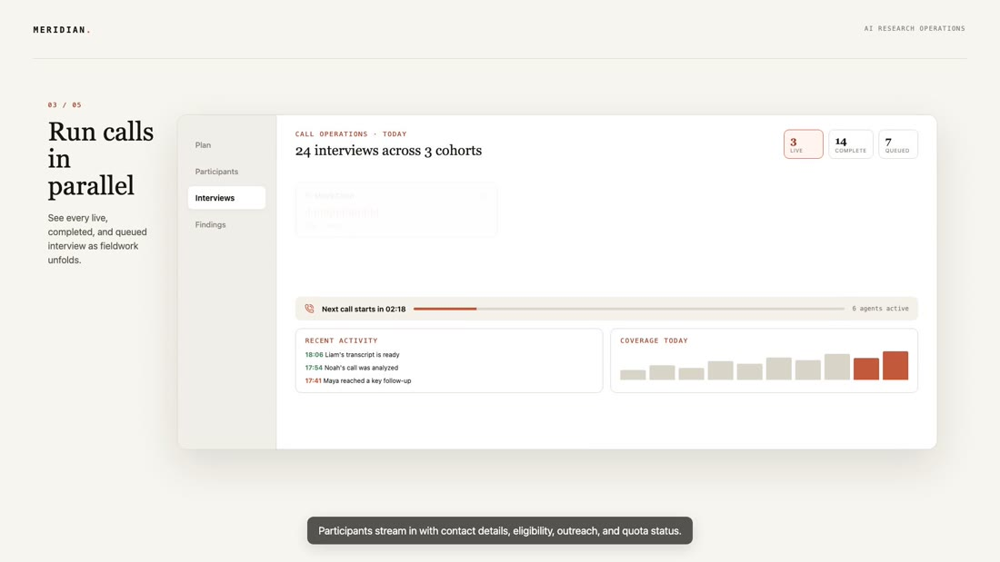
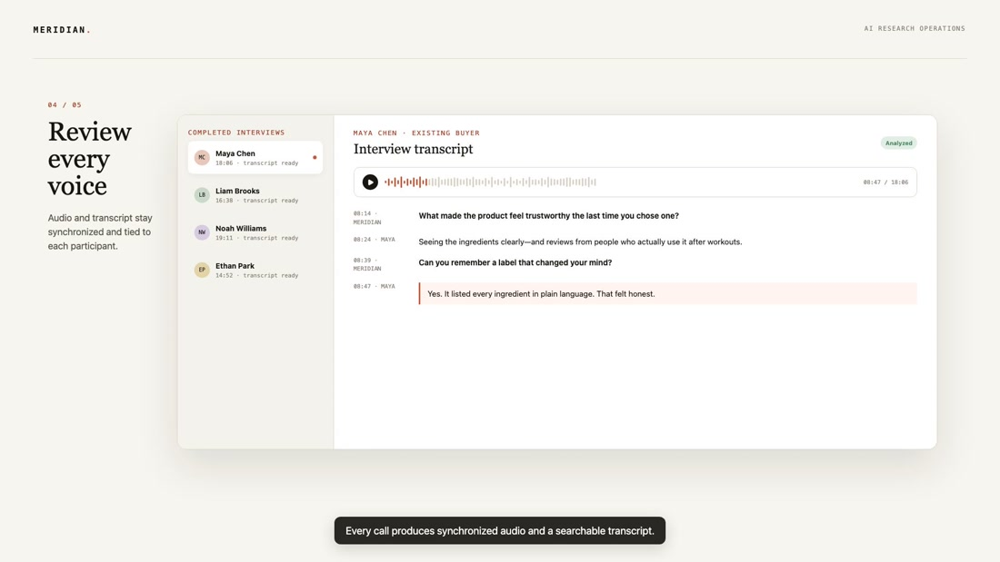
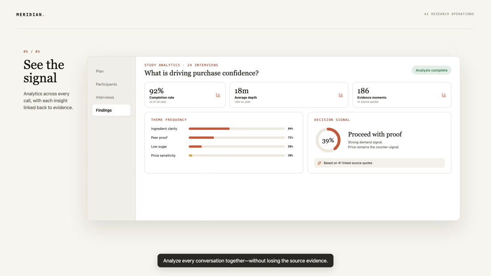
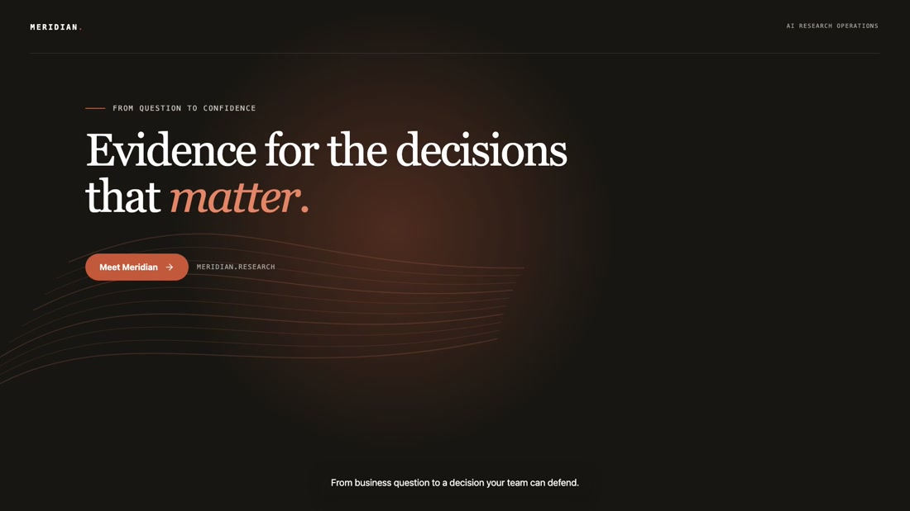
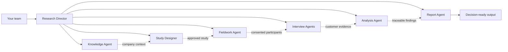

# MERIDIAN

### Evidence for the decisions that matter.

**An AI-native research team that turns a business question into real customer conversations, traceable insight, and a decision-ready report.**

[**▶ Watch the 48-second demo**](https://drive.google.com/file/d/1kKhDwExnEtAF8TuaZcTvWsJBisCf2BJT/view?usp=drive_link)

 

## Research should begin with a decision

Teams rarely need “more data.” They need enough confidence to make a specific choice.

Traditional customer research can take weeks of coordination across study design, recruiting, interviews, synthesis, and reporting. The context gets scattered, the evidence becomes difficult to audit, and the decision keeps waiting.

Meridian begins with one question:

> **What decision are you trying to make?**

From there, it helps a team design the study, reach the right participants, run interviews in parallel, understand the evidence, and deliver a branded research report—without losing human judgment along the way.

## One continuous research journey

### 01 — Frame the decision

Turn a business objective into a clear research plan. Meridian carries the company’s context and the study’s purpose forward, so every question stays connected to the decision.

### 02 — Reach the right people

Upload a participant list, review the audience, and approve outreach before anything is sent. Meridian helps move from a spreadsheet to a governed fieldwork plan.

### 03 — Run conversations in parallel

Launch conversational research across voice, email, and guided response experiences. Follow progress from one fieldwork view while every participant moves through a clear, consent-first journey.

### 04 — Stay close to every voice

Review individual interviews, transcripts, responses, and emerging evidence. The original customer voice remains available—not hidden behind an unexplained summary.

### 05 — See the signal

Meridian brings themes, tensions, segment differences, and limitations together. Each conclusion stays connected to the evidence behind it, helping teams understand both what is known and where uncertainty remains.

### 06 — Move from insight to action

Finish with an editable, decision-ready research narrative in the company’s own voice and brand—ready to share as a report or presentation.

## Not one assistant. A coordinated research team.

Meridian approaches research as a team of focused agents. Each one owns a distinct part of the journey, while a Research Director keeps the work aligned to the original decision.

| Agent | Its role in the research team |
|---|---|
| **Research Director** | Keeps every step anchored to the business decision and coordinates the full study. |
| **Knowledge Agent** | Learns the company, product, brand, and prior context that should shape the work. |
| **Study Designer** | Translates the decision into a focused plan and thoughtful questionnaire. |
| **Fieldwork Agent** | Prepares participants and outreach while preserving explicit human approval. |
| **Interview Agents** | Hold natural, adaptive conversations and listen for depth—not just form completion. |
| **Analysis Agent** | Finds patterns, contradictions, differences, and limitations across the evidence. |
| **Report Agent** | Turns the approved evidence into a branded narrative, PDF, and presentation. |

The result is a system that can move quickly without pretending that research is a single prompt.

## Human control where it matters

Meridian is built around a simple principle: **AI can accelerate the work, but people remain accountable for the research.**

- A person approves the study before participant outreach.
- Participants see clear consent before an interview begins.
- Findings remain traceable to real responses and transcripts.
- Contradictions and limitations are surfaced instead of polished away.
- Company and study context remain visible and editable.
- Final reports can be reviewed and refined before they are shared.

## Built for teams that need answers, not another dashboard

Meridian is for product, strategy, innovation, and research teams facing questions such as:

- Should we launch this product or proposition?
- Why are customers hesitating to adopt?
- Which audience feels the strongest need?
- What is driving—or weakening—purchase confidence?
- Which message resonates, and with whom?
- What evidence should shape the next product decision?

## The vision

We imagine customer research becoming a living capability inside every company: always grounded in real voices, always connected to the decision at hand, and accessible even when a traditional multi-week study is not.

Meridian is the beginning of that research team.

### From a business question to a decision your team can defend.

[**Watch the Meridian demo →**](https://drive.google.com/file/d/1kKhDwExnEtAF8TuaZcTvWsJBisCf2BJT/view?usp=drive_link)

